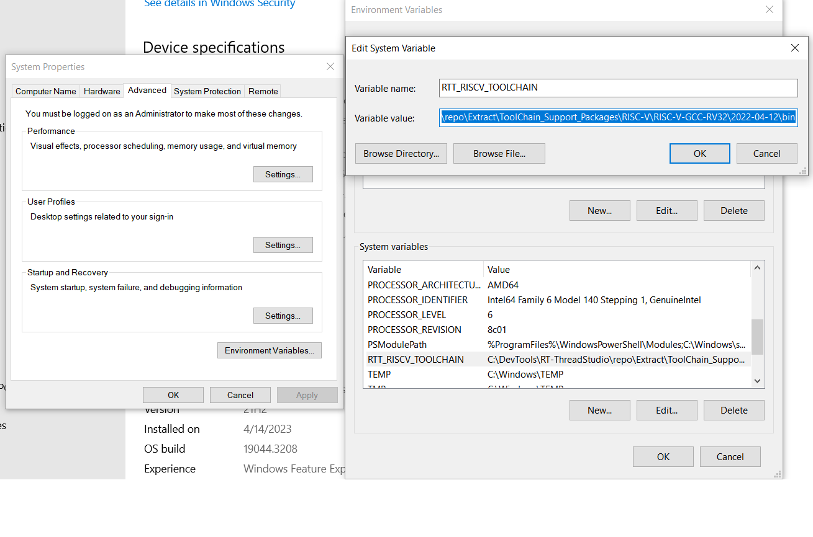

# rtt-bsp-hpm6300evk

RT-Thread Studio BSP for HPM6300EVK Board

## Supported examples

***

- blink_led
- uart_dma_demo
- timer_demo
- sdcard_demo
- flashdb_demo
- can_example
- adc_example
  - Users need to provide valid voltage to ADC1 IN7 pin(J26 Pin5 on HPM6300EVK) first, then runs the adc demo, the sampled voltage will be printed out by the demo via the console UART periodically.
  - Valid voltage range is [0V, 3.3V], make sure the input voltage is in valid range, otherwise the SoC may be demaged.
- ethernet_demo
- ethernet_ptp_master_demo
- ethernet_ptp_slave_demo
- usb_device_generic_hid
- usb_host_msc_udisk

## Environment Setup

### Toolchain setup

- After installing the BSP package, users need to set the `RTT_RISCV_TOOLCHAIN` environment variable before creating any examples/projects
    - Assuming that the toolchain is installed in `C:\DevTools\RT-ThreadStudio\repo\Extract\ToolChain_Support_Packages\RISC-V\RISC-V-GCC-RV32\2022-04-12\bin`, User can set the `RTT_RISCV_TOOLCHAIN` environment variable referring below figure:

